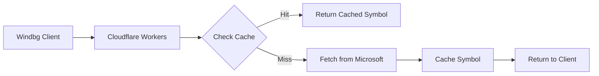

# Windbg Symbol Proxy

A Cloudflare Workers proxy for accelerating Windbg symbol downloads with caching capabilities.

## Features

- 🚀 **High-speed caching** - Caches symbol files from Microsoft Symbol Server
- 🌍 **Global CDN** - Leverages Cloudflare's global network
- ⚡ **Low latency** - Reduced download times for debugging symbols
- 🔄 **Automatic cache management** - 24-hour TTL with automatic refresh
- 📦 **Supports all symbol types** - PDB, DLL, EXE, and other debug files

## Usage

### For Windbg Configuration

In Windbg, set your symbol path to:

```
SRV*C:\Symbols*https://symbols.tokisaki.top
```

Or for the workers.dev domain:

```
SRV*C:\Symbols*https://windbg-symbol-proxy.<your-subdomain>.workers.dev
```

### Direct URL Access

You can also access symbols directly via:

```
https://symbols.tokisaki.top/ntdll.pdb/1234567890ABCDEF1/ntdll.pdb
```

## Deployment

### Prerequisites

1. [Node.js](https://nodejs.org/) (v16+)
2. [Wrangler CLI](https://developers.cloudflare.com/workers/wrangler/): `npm install -g wrangler`
3. Cloudflare account with Workers enabled

### Setup

1. Clone this repository:
   ```bash
   git clone https://github.com/<your-username>/windbg-symbol-proxy.git
   cd windbg-symbol-proxy
   ```

2. Install dependencies:
   ```bash
   npm install
   ```

3. Login to Cloudflare:
   ```bash
   npx wrangler login
   ```

4. Configure your domain (optional):
   - Update `wrangler.toml` with your custom domain
   - Or use the default workers.dev domain

5. Deploy:
   ```bash
   npm run deploy
   ```

## Configuration

### Environment Variables

Set in `wrangler.toml`:

- `SYMBOL_SERVER`: Upstream symbol server (default: Microsoft)
- `CACHE_TTL`: Cache time-to-live in seconds (default: 86400 = 24h)
- `MAX_FILE_SIZE`: Maximum file size to cache in bytes (default: 100MB)

### Cache Management

The proxy uses Cloudflare KV for caching. Cache keys follow the pattern:
```
symbol:{path}
```

Example:
```
symbol:/ntdll.pdb/1234567890ABCDEF1/ntdll.pdb
```

## Architecture



## Performance Benefits

- **First download**: Slightly slower (adds proxy overhead)
- **Subsequent downloads**: Much faster (served from cache)
- **Geographic distribution**: Symbols cached globally

## Testing

### Health Check

```
GET https://symbols.tokisaki.top/health
```

### Test Symbol Download

```bash
curl -I https://symbols.tokisaki.top/ntdll.pdb/1234567890ABCDEF1/ntdll.pdb
```

## Development

```bash
# Local development
npm run dev

# Deploy to production
npm run deploy

# Check logs
npx wrangler tail
```

## License

MIT License - see LICENSE file for details.

## Contributing

1. Fork the repository
2. Create a feature branch
3. Make your changes
4. Submit a pull request

## Support

For issues and questions, please open an issue on GitHub.